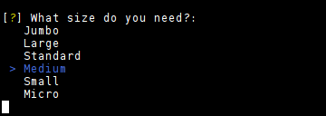
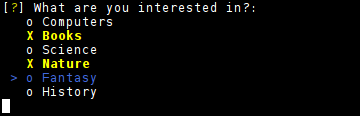

Examples
========

You can find all these examples at :code:`examples` directory.

text.py
-----------

.. literalinclude:: ../../examples/text.py

Result on something like:

|inquirer text|

confirm.py
-----------

.. literalinclude:: ../../examples/confirm.py

Result on something like:

|inquirer confirm|

list.py
-----------

.. literalinclude:: ../../examples/list.py

Result on something like:

|inquirer list|

checkbox.py
-----------

.. literalinclude:: ../../examples/checkbox.py

Result on something like:

|inquirer checkbox|

theme.py
-----------

.. literalinclude:: ../../examples/theme.py

Result on something like:

|inquirer theme|

.. |inquirer text| image:: images/inquirer_text.png
  :alt: Example of Text Question

.. |inquirer confirm| image:: images/inquirer_confirm.png
  :alt: Example of Confirm Question

.. |inquirer theme| image:: images/inquirer_theme.gif
  :alt: Example of theme (GreenPassion)
