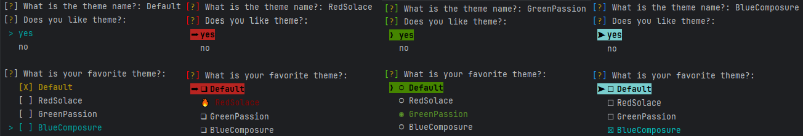

Usage
=====

The idea is quite simple:

#. Create an array of :code:`Questions`
#. Call the prompt render.

Each :code:`Question` require some common arguments. So, you just need to know which kind of :code:`Questions` and :code:`Arguments` are available.

Question types
--------------

+-------------+--------------------------------------------------------+
|**TEXT**     | Expects a text answer.                                 |
+-------------+--------------------------------------------------------+
|**EDITOR**   | Expects a text answer, entered through external editor.|
+-------------+--------------------------------------------------------+
|**PASSWORD** | Do not prompt the answer.                              |
+-------------+--------------------------------------------------------+
|**CONFIRM**  | Requires a boolean answer.                             |
+-------------+--------------------------------------------------------+
|**LIST**     | Show a list and allow to select just one answer.       |
+-------------+--------------------------------------------------------+
|**CHECKBOX** | Show a list and allow to select a bunch of them.       |
+-------------+--------------------------------------------------------+
|**PATH**     | Requires valid path and allows additional validations. |
+-------------+--------------------------------------------------------+

There are pictures of some of them in the Examples_ section.

Question Arguments
------------------

The main object is :code:`Question`, but it should not be
instantiated. You must use any of the subclasses, listed below. All of
them have the next attributes that can be set in the initialization:

name
~~~~

It will be the key in the hash of answers. So, it is **mandatory**.

You can use any ``String`` or ``hashable`` code as value.

message
~~~~~~~

Contains the prompt to be shown to the user, and is **mandatory** too.

You can use a new style formatted string, using the previous answers, and it will be replaced automatically:

.. code:: python

          questions = [
              Text(name='name', message="What's your name?"),
              Text(name='surname', message="What's your surname, {name}")
          ]

The value can be a ``function``, with the next sign:

.. code:: python

          def get_message(answers): return str()

Example:

.. code:: python

          def get_message(answers):
              return "What's your name?"

          Text(name='name', message= get_message)

Where ``answers`` is the dictionary with previous answers.

If the ``message`` is too long for the terminal, it will be cut to fit.

default
~~~~~~~

Stores the default value to be used as answer. This allow the user just to press `Enter` to use it. It is optional, using ``None`` if there is no input and no default value.

As in ``message``, you can use a new format string or a function with the sign:

.. code:: python

          def get_default(answers): return str()

Where ``answers`` is a ``dict`` containing all previous answers.

Remember that it should be a list for `Checkbox` questions.

choices
~~~~~~~

**Mandatory** just for ``Checkbox`` and ``List`` questions; the rest of them do not use it.

It contains the list of selectable answers.

Its value can be a ``list`` of strings, new format style strings or pairs(tuples) or a `function` that returns that list, with the sign:

.. code:: python

          def get_choices(answers): return list(str())

If any of the list values is a pair, it should be a tuple like: ``(label, value)``. Then the ``label`` will be shown but the ``value`` will be returned.

As before, the ``answers`` is a `dict` containing the previous answers.

validate
~~~~~~~~

Optional attribute that allows the program to check if the answer is valid or not. It requires a `boolean` value or a `function` with the sign:

.. code:: python

          def validate(answers, current): return boolean()

Where ``answers`` is a `dict` with previous answers again and ``current`` is the current answer.
If you want to customize the validation message, you can raise your own error with specific reason:
``inquirer.errors.ValidationError('', reason='your reason that will be displayed to the user')``
inside the validation function, but be aware that if the validation passes you still have to return `True`!

Example:

.. code:: python

    from inquirer import errors
    import random

    def validation_function(answers, current):
       if random.random() > 0.5:
          raise errors.ValidationError('', reason='Sorry, just have bad mood.')

       return True

    Text('nothing', "Moody question", validate=validation_function)
    Text('age', "How old are you?", validate=lambda _, c: 0 <= c < 120)

ignore
~~~~~~

Questions are statically created and some of them may be optional depending on other answers. This attribute allows to control this by hiding the question.

It's value is `boolean` or a `function` with the sign:

.. code:: python

          def ignore(answers): return boolean()

where ``answers`` contains the `dict` of previous answers again.

Example:

.. code:: python

   questions = [
       inquirer.Text("name", message="What's your name?"),
       inquirer.Text(
           "surname",
           message="What's your surname, {name}?",
           ignore=lambda x: x["name"].lower() == "anonymous"
       ),
       inquirer.Confirm("married", message="Are you married?"),
       inquirer.Text(
           "time_married",
           message="How long have you been married?",
           ignore=lambda x: not x["married"]
       )
   ]

Path Question
-------------

Path Question accepts any valid path which can be both absolute or relative.
By default it only validates the validity of the path. Except of validation
it return normalized path and it expands home alias (~).

The Path Question have additional arguments for validating paths.

path_type
~~~~~~~~~

Validation argument that enables to enforce if the path should be aiming
to file (``Path.FILE``) or directory (``Path.DIRECTORY``).

By default nothing is enforced (``Path.ANY``).

.. code:: python

          Path('log_file', 'Where should be log files located?', path_type=Path.DIRECTORY)

exists
~~~~~~

Validation argument that enables to enforce if the provided path should
or should not exists. Expects ``True`` if the path should
exists, or ``False`` if the path should not exists.

By default nothing is enforced (``None``)

.. code:: python

          Path('config_file', 'Point me to your configuration file.', exists=True, path_type=Path.File)

normalize_to_absolute_path
~~~~~~~~~~~~~~~~~~~~~~~~~~

Argument which will enable normalization on the provided path. When enabled, in case of relative path would be provided
the Question will normalize it to absolute path.

Expects ``bool`` value. Default ``False``.

.. code:: python

          Path('config_file', 'Point me to your configuration file.', normalize_to_absolute_path=True)

Creating the Question object
----------------------------

With this information, it is easy to create a ``Question`` object:

.. code:: python

          Text('name', "What's your name?")

It's possible to load the :code:`Question` objects from a :code:`dict`, or even the whole list of them, with the method :code:`load_from_dict` and :code:`load_from_list`, respectively.

The method :code:`load_from_json` has been added as commodity to use JSON inputs instead. Here you have an example:

.. literalinclude:: ../examples/questions_from_json.py

The prompter
------------

The last step is to call the *prompter* With the list of :code:`Question`:

.. code:: python

      answers = inquirer.prompt(questions)

This line will ask the user for information and will store the answeres in a dict, using the question name as **key** and the user response as **value**.

Remember the ``prompt`` always require a list of ``Question`` as input.

Themes
------

Simply change the colorscheme and some icons passing a theme object defined in inquirer.themes.
You can define your own via class, dict or json or you can use on of the pre-defined themes: `Default`, `GreenPassion` and `BlueComposure`.
Keep in mind however, that not every console supports all colors and unicode-characters! So test which theme works for you.

|inquirer themes compare|

Here is an example how to use a theme:

.. literalinclude:: ../examples/theme.py

Result:

|inquirer theme|

Shortcut functions
------------------

For one-off prompts, you can use the shortcut functions.

.. code-block:: python

      text = inquirer.text(message="Enter your username")
      password = inquirer.password(message='Please enter your password'),
      choice = inquirer.list_input("Public or private?",
                                    choices=['public', 'private'])
      correct = inquirer.confirm("This will delete all your current labels and "
                              "create a new ones. Continue?", default=False)

.. _Examples: examples.html

Autocompletion
------------------

You can optionally provide an autocompletion function to the ``Text`` question type and the ``Checkbox`` question type's "Other" option (if enabled).

The autocompletion function is called with the current input string (``text``) as the first argument and the number of times the user has pressed TAB as the second argument (``state``). If the user changes their input, ``state`` will reset to 0.

This information can be used to provide completion based on what the user has already input, and/or the number of times the user has pressed TAB, allowing you to cycle through multiple possible completions.

The function should return what to replace the entire current input with as a ``str``. Any other types will be ignored.

.. literalinclude:: ../examples/text_autocomplete.py
